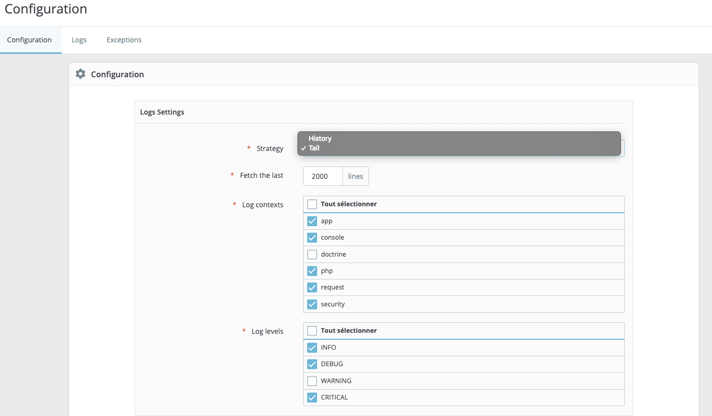
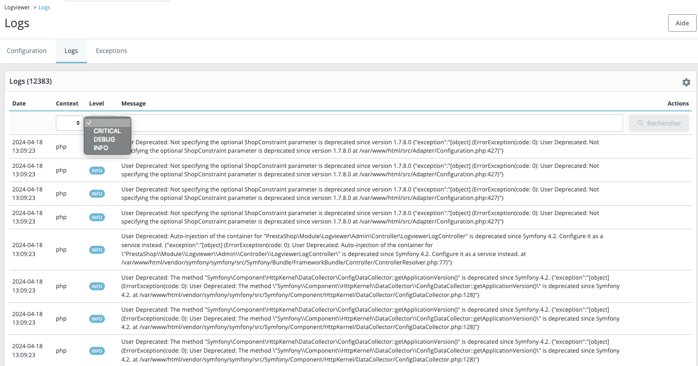

# logviewer
Logviewer is a Prestashop module that allows you to check out your shop's logs and exceptions from the back-office (for those who can't be bothered with using a shell or grap the logs via FTP).   
# The settings
There are two strategies to acquire logs:
- History: n days history (between 1 and 5 days)
- Tail: n last lines of the file (between 100 and 5000 lines)  
  
For either strategy you'll be able to set the amount of logs you want to see by setting 
- the number of days (History)
- the number of lines to be read (Tail)  
  

Both allow you to select the types of logs you want (by context and level, which apply only to logs).   
  
  

Exceptions are always read sequentially.  

# The list views
There are two lists:
- logs (read from either dev.log or prod.log)
- exceptions (read from the dated exceptions logs)   

Both lists are reset each time the configuration is changed.   
The lists are not updated automatically (they could be but I've decided against it) but via the settings icon at the top right corner of each grid view.
Both lists can filtered and searched.
  
  

  

# Requirements
- PHP >= 8.1
- Prestashop >= 8
